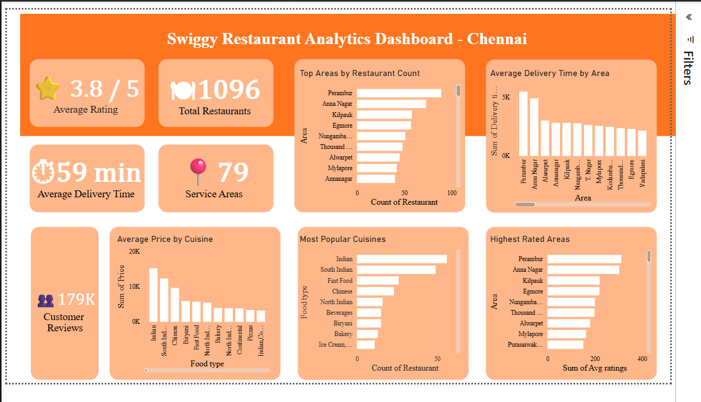
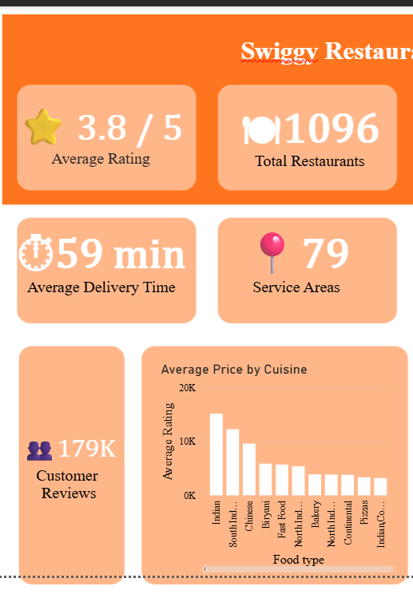
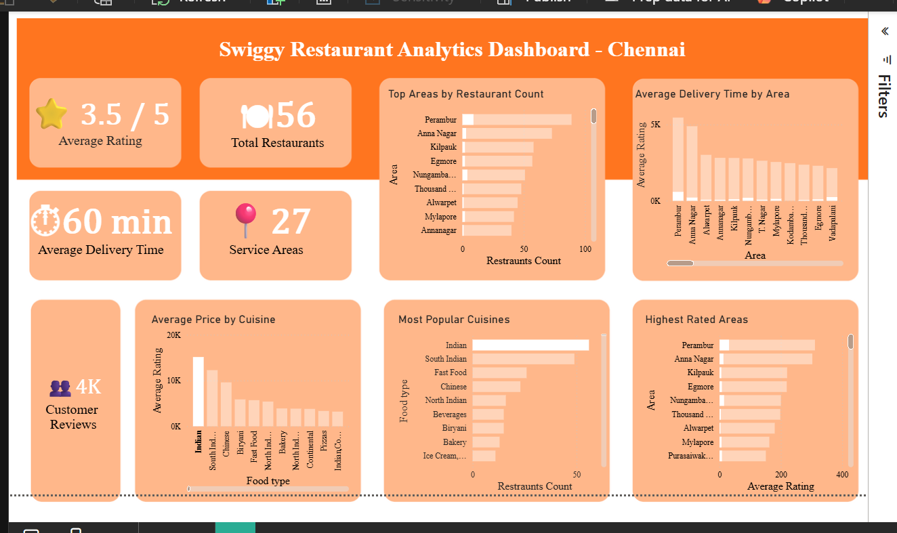

# 🍽️ Swiggy Restaurant Analytics Dashboard

> **An interactive Business Intelligence dashboard built using Power BI to analyze restaurant performance, customer preferences, pricing trends, and delivery efficiency across Chennai.**

---

# 📌 Project Information

| Attribute            | Details                                                  |
| -------------------- | -------------------------------------------------------- |
| **Project Name**     | Swiggy Restaurant Analytics Dashboard                    |
| **Domain**           | Food Delivery Analytics                                  |
| **Project Type**     | Business Intelligence Dashboard                          |
| **Tools Used**       | Power BI, Power Query, Microsoft Excel, DAX, Git, GitHub |
| **Dataset**          | Swiggy Restaurant Dataset                                |
| **Difficulty Level** | Beginner → Intermediate                                  |
| **Status**           | ✅ Completed                                              |
| **Version**          | v1.0                                                     |

---

# 📖 Project Overview

The **Swiggy Restaurant Analytics Dashboard** is a Business Intelligence project developed using **Power BI** to transform raw restaurant data into meaningful business insights.

The dashboard helps analyze restaurant distribution, customer ratings, cuisine popularity, pricing trends, customer engagement, and delivery performance across Chennai.

The primary objective of this project is to demonstrate how raw business data can be converted into actionable insights through effective data visualization and storytelling.

---

# 🎯 Business Problem

Swiggy serves thousands of customers across multiple service areas. Understanding customer preferences, restaurant distribution, pricing patterns, delivery performance, and customer satisfaction is essential for improving business operations and supporting strategic decision-making.

This dashboard was created to provide a centralized view of restaurant analytics that enables stakeholders to identify trends and make informed business decisions.

---

# 👥 Stakeholders

This dashboard is designed for:

* Business Managers
* Operations Managers
* Marketing Teams
* Restaurant Partners
* Business Analysts

---

# ❓ Business Questions

The dashboard answers the following business questions:

* Which areas have the highest restaurant concentration?
* Which cuisines are most popular among customers?
* Which cuisines have the highest average pricing?
* Which areas have the highest customer ratings?
* Which locations experience longer delivery times?
* How many restaurants are operating in Chennai?
* How many customer reviews have been recorded?
* How many service areas are covered?

---

# 📊 Dashboard Preview

## Complete Dashboard



---

## KPI Section



---

# 📈 Key Performance Indicators (KPIs)

| KPI                     | Description                                |
| ----------------------- | ------------------------------------------ |
| ⭐ Average Rating        | Measures overall customer satisfaction     |
| 🍽 Total Restaurants    | Total restaurants available in the dataset |
| ⏱ Average Delivery Time | Measures delivery efficiency               |
| 👥 Customer Reviews     | Total customer engagement                  |
| 📍 Service Areas        | Geographic service coverage                |

---

# 📉 Dashboard Visualizations

The dashboard includes the following analytical reports:

* 📍 Top Areas by Restaurant Count
* ⭐ Highest Rated Areas
* 🍴 Most Popular Cuisines
* 💰 Average Price by Cuisine
* 🚚 Average Delivery Time by Area

---

# 💡 Key Business Insights

* Perambur has one of the highest restaurant concentrations in the dataset.
* Indian and South Indian cuisines dominate the restaurant market.
* Premium cuisines generally have higher average pricing.
* Customer ratings vary across different service areas, highlighting opportunities for service improvement.
* Delivery time differs significantly by location, indicating potential operational optimization opportunities.

---

# 🎛 Interactive Features

The dashboard supports interactive filtering, allowing users to dynamically analyze restaurant performance based on selected criteria.

**Interactive Dashboard Example**



---

# 🛠 Tools & Technologies

* Microsoft Power BI Desktop
* Power Query
* Microsoft Excel
* DAX
* Git
* GitHub

---

# 📂 Repository Structure

```text
Swiggy-Restaurant-Analytics-Dashboard
│
├── Dashboard
│   └── Swiggy Dashboard.pbix
│
├── Dataset
│   └── swiggy.csv
│
├── Assets
│   ├── dashboard-overview.png
│   ├── kpi-section.png
│   ├── filter-demo.png
│   ├── top-areas.png
│   ├── delivery-time-by-area.png
│   ├── average-price-by-cuisine.png
│   ├── most-popular-cuisines.png
│   └── highest-rated-areas.png
│
├── README.md
├── LICENSE
└── .gitignore
```

---

# 📚 Documentation

## Dataset

The dataset contains restaurant-related information including:

* Restaurant Name
* Area
* Cuisine
* Average Rating
* Price
* Delivery Time
* Customer Reviews
* Service Area

---

## Data Preparation

The dataset was prepared before visualization by performing:

* Data type validation
* Data cleaning
* Column formatting
* Missing value verification
* Data transformation using Power Query

---

## Dashboard Development Process

1. Understand the business problem.
2. Identify business questions.
3. Explore the dataset.
4. Clean and transform the data.
5. Build KPI measures.
6. Design meaningful visualizations.
7. Generate business insights.
8. Publish the project on GitHub.

---

# 🧠 Challenges Faced

During this project, I encountered several challenges:

* Selecting meaningful KPIs.
* Choosing appropriate visualizations.
* Improving dashboard alignment and spacing.
* Formatting KPI cards professionally.
* Organizing a GitHub repository.
* Writing technical documentation.

---

# ✅ Solutions Implemented

To overcome these challenges, I:

* Improved dashboard layout and spacing.
* Replaced generic chart titles with business-friendly titles.
* Optimized KPI card formatting.
* Structured the repository into Dashboard, Dataset, and Assets folders.
* Added comprehensive project documentation.

---

# 📖 Skills Demonstrated

* Business Intelligence
* Data Cleaning
* Data Transformation
* Dashboard Design
* KPI Development
* Data Visualization
* Business Analysis
* Power Query
* DAX
* Git & GitHub
* Technical Documentation

---

# 🚀 Future Improvements (Version 2.0)

* Dynamic Titles using DAX
* Drill-through Pages
* Advanced Tooltips
* Bookmarks
* Navigation Buttons
* Enhanced Dashboard UI
* Mobile Layout Optimization
* Additional Business KPIs

---

# 🎓 Learning Outcomes

This project helped strengthen my understanding of:

* Converting business requirements into dashboards.
* Selecting meaningful KPIs.
* Creating effective business visualizations.
* Structuring GitHub repositories professionally.
* Documenting analytics projects.
* Applying Business Intelligence best practices.

---

# 👨‍💻 Author

**Syed Ayman T.**

**B.Tech – Artificial Intelligence & Data Science**

📧 Email: [syedaymanthameem@gmail.com](mailto:syedaymanthameem@gmail.com)

💻 GitHub: https://github.com/ayman-1707

🔗 LinkedIn: https://www.linkedin.com/in/syed-ayman-3182083b7

---

# ⭐ Version History

| Version  | Description                                                  |
| -------- | ------------------------------------------------------------ |
| **v1.0** | Initial release of the Swiggy Restaurant Analytics Dashboard |

---

> ⭐ **If you found this project helpful or interesting, consider giving it a star on GitHub!**
